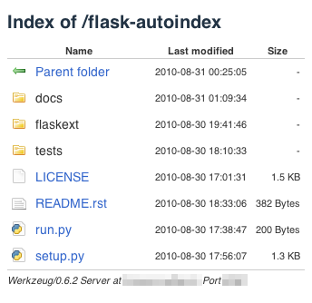

Flask-AutoIndex
~~~~~~~~~~~~~~~

.. module:: flask_autoindex

Flask-AutoIndex generates an index page for your `Flask`_ application
automatically. The result just like `mod_autoindex`_, but the look is more
awesome! Look at this:



This module contains pre-designed template and css file. It is default
style, but you can make your own style.

.. note::

   Flask-AutoIndex uses `Flask-Silk`_ to serve icons. Per default, the icons
   from Mark James's `Silk`_ icon set are used. These icons are licensed
   under `Creative Commons Attribution 2.5 License <CC-BY-2.5>`_ or
   `3.0 License <CC-BY-3.0>`_. Before using the icons, read the license.

.. _Flask: http://flask.pocoo.org/
.. _mod_autoindex: http://httpd.apache.org/docs/current/mod/mod_autoindex.html
.. _Flask-Silk: http://packages.python.org/Flask-Silk
.. _Silk: http://www.famfamfam.com/lab/icons/silk/
.. _CC-BY-2.5: http://creativecommons.org/licenses/by/2.5
.. _CC-BY-3.0: http://creativecommons.org/licenses/by/3.0

Installation
============

Install Flask-AutoIndex with ``easy_install`` or ``pip`` command::

    $ easy_install Flask-AutoIndex
 
::

    $ pip install Flask-AutoIndex

or check out development version::

    $ git clone git://github.com/sublee/flask-autoindex.git

How to Use
==========

Flask-AutoIndex is easy and extensible. It supports flask application.

We will make the application in flask application. There is a basic usage::

    import os.path
    from flask import Flask
    from flask_autoindex import AutoIndex

    app = Flask(__name__)
    AutoIndex(app, browse_root=os.path.curdir)

    if __name__ == '__main__':
        app.run()

After running the application, ``http://localhost/`` serves a generated index
page which contains the file and directory list in current directory.

Or, use a shipped console script. Just type ``fai`` in command line.
(yes, ``fai`` is an acronym of Flask-AutoIndex)::

    $ fai
     * Running on http://127.0.0.1:5000/

Customizing
===========

Routing a specified URL
```````````````````````

Just like a normal flask application or module. Follow the below example::

    @app.route('/helloworld')
    def helloworld():
        return 'Hello, world!', 200

``http://localhost/helloworld`` will serve ``Hello, world!`` not 
``/helloworld`` directory.

Adding an icon rule
```````````````````

If you want to present ``*.feed`` files with ``rss.png`` icon and present
a directory named ``picture`` with ``folder_picture.png`` icon, follow the
below example::

    idx.add_icon_rule('rss.png', ext='feed')
    idx.add_icon_rule('folder_picture.png', dirname='pictures')

You can change the root directory's icon to your own icon::

    idx.add_icon_rule('http://example.org/favicon.ico', cls=RootDirectory)

Also you can add the more complex rule with a function::

    import re
    def is_flaskext(ent):
        return isinstance(ent, Directory) and re.match('[Ff]lask-', ent.name)
    idx.add_icon_rule('http://example.org/flask-extenstion.png', is_flaskext)

Here is a nice example for changing directory's icon to its ``favicon.ico``
file if it exists::

    def get_favicon(ent):
        favicon = 'favicon.ico'
        if type(ent) is Directory and favicon in ent:
            return '/' + os.path.join(ent.path, favicon)
        return False
    idx.add_icon_rule(get_favicon)

.. seealso:: :meth:`AutoIndex.add_icon_rule`

Changing Silk's path
````````````````````

:class:`AutoIndex` has ``**silk_options`` keyword arguments for :class:`Silk`.
If you want to use the another path for serving silk icons, use ``silk_path``
keyword argument::

    idx = AutoIndex(app, silk_path='/myicons')

Now you can get a silk icon from ``http://localhost/myicons/folder.png`` not
``http://localhost/__icons__/folder.png``.

.. seealso::
   The documentation for `Flask-Silk`_

Redesigning the template
````````````````````````

:meth:`AutoIndex.render_autoindex` finds the template from the application's
template directory first. When you made the ``autoindex.html`` to the
application's template directory, :meth:`AutoIndex.render_autoindex` renders
your template::

    - myapplication
      - templates
        - autoindex.html
      - __init__.py
      - views.py

Your templates could extend the default Flask-AutoIndex's template, it named
``__autoindex__/autoindex.html``. Here is a basic example:

.. sourcecode:: jinja

   

   
     {{ super() }}
     <link rel="stylesheet"
       href="{{ url_for('static', filename='myautoindex.css') }}" />
   

   
     <div style="width: 500px; margin: 30px auto;">
       <h2>My Application</h2>
   

   
     </div>
   

To get extra fields through to your template, pass them in the
``template_context`` keyword argument::

    AutoIndex(app, template_context = dict(SITENAME = 'My cool site'))

API
===

Configuration
`````````````

.. autoclass:: AutoIndex
   :members:

Models
``````

.. autoclass:: Entry
   :members:

.. autoclass:: File
   :members:

.. autoclass:: Directory
   :members:

.. autoclass:: RootDirectory
   :members:

Template
````````

Blocks
------

`meta`
    The innerHTML of ``<head>``.

`header`
    The top of ``<body>``.

`table`
    The table for the entry list.

`footer`
    The bottom of ``<body>``.

Variables
---------

`curdir`
    The current directory object.

`entries`
    The child entry list of ``curdir``.

`sort_by`
    The sorting key.

`order`
    Ascending order(``1``) or Descending order(``-1``).

`endpoint`
    The endpoint which renders a generated page.

Licensing and Author
====================

This project is licensed under BSD_. See LICENSE_ for the details.

I'm `Heungsub Lee`_. Any regarding questions or patches are welcomed.

.. _BSD: http://en.wikipedia.org/wiki/BSD_licenses
.. _LICENSE: https://github.com/sublee/flask-autoindex/blob/master/LICENSE
.. _Heungsub Lee: http://subl.ee/

Indices and tables
==================

* :ref:`genindex`
* :ref:`modindex`
* :ref:`search`
